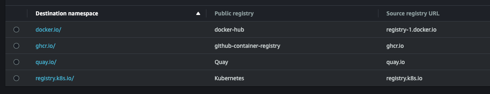

# Mutating webhook for ECR Pull-Through
The mutation webhook for ECR pull-through is a mechanism that intercepts requests to create or update pods in Kubernetes. It modifies the container image references in the pod specifications to use the ECR pull-through mechanism. This allows the pods to pull container images from the ECR registry through a local cache, improving performance and reducing network egress costs.

By using the mutation webhook, you can seamlessly integrate ECR pull-through into your Kubernetes cluster, ensuring that all pods automatically use the optimized image retrieval process.

## Prerequisite
Before you begin, you must manually create a Pull Through cache configuration for `ghcr.io`, `docker.io`, `registry.k8s.io`, and `quay.io`, using names that are similar. **This is a prerequisite explicitly for this Mutating Webhook, as per AWS you can create Pull-Through configuration with any name.** At the time of writing, it is not possible to automate this process via Terraform, so manual setup is required, along with the creation of "Creation templates".   
*An example of how it should look is provided here:* 
Bonus (optional): Within the `aws-policies` folder, you'll find an example lifecycle policy that can be utilized in your "Creation Templates" and an example ECR Registry policy. This policy is necessary to allow EKS to create new repositories with images that are pulled through ECR. You can set ECR registry action permissions directly on your EKS node's role and avoid setting any permissions in ECR Registry itself. You choose.  
Official AWS docs with more information about configuring ECR Pull-Through you can find here: https://docs.aws.amazon.com/AmazonECR/latest/userguide/pull-through-cache.html#pull-through-cache-iam
 
## Configuration via Kyverno (no docker.io available)
For those who prefer to configure using Kyverno, policies for `quay.io`, `registry.k8s.io`, and `ghcr.io` are available in the **kyverno** folder.  
Currently, due to some limitations with Kyverno, it has not been possible to develop a reliable policy for `docker.io`. At least I didnt find a way to do it properly. If you can, then you are warmly welcome to contribute to this repository! Kindly note, as per the [official AWS documentation](https://docs.aws.amazon.com/AmazonECR/latest/userguide/pull-through-cache-working.html#pull-through-cache-working-pulling): 
> For Docker Hub official images, the /library prefix must be included. For all other Docker Hub repositories, you should omit the /library prefix.  

For `docker.io` consider using mutation webhook.  
**Don't forget to update the AWS account ID inside the Kyverno policies before applying.**

## Configuration via Mutating Webhook

1. Pull the repository
2. Update the [manifests/configmap.yaml](manifests/configmap.yaml) according to your needs
3. Make sure your kubectl context is configured for the desired cluster.
4. Install it via `./install.sh`

### Important NOTE: this webhook will perform mutation within namespaces that have the label `pull-through-enabled: "true"`. 
If you want to change this behaviour, then update the MutatingWebhookConfiguration inside [manifests/bundle.yaml](manifests/bundle.yaml) where `namespaceSelector` is set. If you want to have it cluster wide, then just remove the `namespaceSelector` block.

**(Optional, but recommended)** You can build the image and push it to your ECR repository. Don't forget to update the image in the mutating webhook Deployment.

## Some other useful stuff
### Tests
A couple of pod manifests for testing you can find in `tests` folder to test the installed webhook is performing properly within your cluster. After installing webhook and applying manifests from test folder check that your images are updated accordingly.
### ECR Repository cleanup
Script [ecr-cleanup.sh](ecr-cleanup.sh) helps delete all repositories that were made by Pull-Through and ECR Creation Templates. It's useful if there's a mistake in your Creation Template and you need to get rid of repositories with a certain prefix so that Pull-through can make them again. This makes it easier to fix and clean up your repositories.